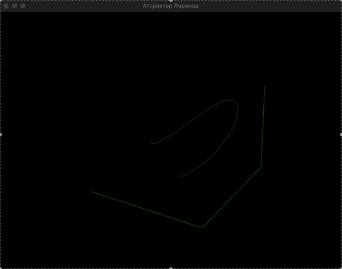

# Аттрактор Лоренца

Этот проект реализует визуализацию аттрактора Лоренца с помощью Python, библиотеки Matplotlib и интерфейса Tkinter. Аттрактор Лоренца является известной системой динамических уравнений, которая демонстрирует хаотическое поведение.

## Описание

Аттрактор Лоренца описывается следующими уравнениями:

- \( \frac{dx}{dt} = \sigma (y - x) \)
- \( \frac{dy}{dt} = x (r - z) - y \)
- \( \frac{dz}{dt} = xy - \beta z \)

где \( \sigma, r, \beta \) — параметры системы.

Этот проект позволяет визуализировать аттрактор в 3D-пространстве и анимировать его появление.

## Установка

1. Склонируйте репозиторий:
   ```bash
   git clone https://github.com/ваше_имя_пользователя/lorenz_attractor.git
   cd lorenz_attractor
Установите необходимые библиотеки:
bash
Копировать код
pip install numpy matplotlib scipy
Запуск
Чтобы запустить приложение, выполните:

bash
Копировать код
python main.py
Используемые технологии
Python
Matplotlib
Tkinter
NumPy
SciPy
Полезные ссылки
Вот некоторые статьи и ресурсы, которые помогут вам лучше понять аттрактор Лоренца и хаос в динамических системах:

- [Чудо аттрактора Лоренца (Wikipedia)](https://ru.wikipedia.org/wiki/%D0%90%D1%82%D1%82%D1%80%D0%B0%D0%BA%D1%82%D0%BE%D1%80_%D0%9B%D0%BE%D1%80%D0%B5%D0%BD%D1%86%D0%B0)
- [Аттрактор Лоренца: визуализация хаоса](https://habr.com/ru/companies/vk/articles/513016/)

## Результат

Ускорено в 30 раз


